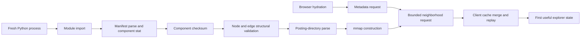

# Full opening-tree scale-up result — 4 August 2026

## Decision

The full accepted-game packed tree is reproducibly built and locally validated.
It contains 6,516,478 accepted games in 2,524,966,683 component bytes. Two
independent builds are component-identical and share dataset version
`1e876810b96364e4bf9f23d49fb509a843783253`.

The next recommended step is an isolated, preview-only Vercel Large Functions
trial of one full immutable artifact. The current service project is on Fluid
compute, was created after the automatic-enrolment cutoff, and the 2.525 GB
artifact is below the current 5 GB Large Functions public-beta cap. This is not
yet a production recommendation: local reader readiness is about 5.96 seconds,
but deployment materialization and hosted cold-start time cannot be measured
without the approval-gated upload.

No full artifact was uploaded. No paid resource was provisioned. No production
configuration, alias, deployment, crawler, or `data/crawler.db` was changed or
opened.

## First-load phase model



The initial delay is not one undifferentiated data-size cost:

| Phase | Scaling class | Explanation |
| --- | --- | --- |
| module import, manifest parse | constant | independent of the artifact corpus |
| component `stat` and mmap construction | file-count-dependent | seven components are checked/mapped; mapping does not copy their bytes |
| checksum | artifact-byte-linear | every component byte is read once |
| structural validation | node-and-edge-record-linear | every fixed-width node and edge record is checked |
| posting-directory parse | posting-directory-byte-dependent | parses `postings.json`, not every posting ordinal |
| metadata | constant | manifest-derived response |
| unfiltered/exact-pair neighborhood | bounded per request | remains under 500 nodes and 256 KiB defaults |
| White/Black player filtering | selected-posting-dependent | result histograms decode the selected games once per response |
| browser merge/replay | bounded per response/path | the packed artifact never reaches the browser |

The checksum classification was independently checked with the older 49.83 MB
representative: its 18.74 ms median checksum was approximately 1.33 times the
14.13 ms time for the 36.78 MB representative, matching the approximately 1.35
byte ratio.

### Fresh-process representative versus full

Twenty fresh processes were used for each result. Values are P50, with P95 in
parentheses.

| Phase | Representative, 36.78 MB | Full, 2.525 GB |
| --- | ---: | ---: |
| module import | 27.12 ms (27.99) | 28.03 ms (28.19) |
| total reader startup | 103.88 ms (110.59) | 5,956.87 ms (6,055.58) |
| manifest parse | 0.071 ms (0.083) | 0.059 ms (0.062) |
| component stat | 0.051 ms (0.070) | 0.045 ms (0.048) |
| checksum | 14.13 ms (15.18) | 945.06 ms (948.04) |
| structural validation | 76.85 ms (78.22) | 4,904.70 ms (5,010.12) |
| posting-directory parse | 7.56 ms (7.97) | 96.39 ms (98.18) |
| mmap construction | 5.00 ms (5.35) | 6.68 ms (8.11) |
| first root | 12.73 ms (13.16) | 23.25 ms (23.92) |
| warm root | 4.68 ms (4.90) | 22.44 ms (22.77) |
| peak RSS | 50.27 MB | 521.76 MB |

The first full root originally took about 569 ms because the entire result
posting was converted to a Python tuple. A test-first mmap-backed range reader
removed that artifact-size-dependent materialization; the root is now bounded
at about 23 ms. The approximately 522 MB startup RSS is caused primarily by
deliberately touching the 418.5 MB node file and 69.8 MB edge file during full
structural validation, not by mmap construction.

## Input and recovery preflight

The source was the designated compressed recovery artifact, not the live DB:

- compressed backup:
  `/Users/aronteh/Desktop/Coding_Adventures/bughouse/crawler-post-qualification-20260802.db.zst`;
- compressed bytes: 3,160,490,691;
- compressed SHA-256:
  `90bc1778829eaf52bab881e0b02947e1635320a691f889330716635d94094872`;
- `zstd --test`: passed;
- restored immutable input:
  `snapshots/full-tree-input-20260804/restored-crawler-post-qualification-20260802.db`;
- restored bytes: 15,146,962,944;
- restored SHA-256:
  `04b5694a288f1b0a966524090e991d70aa695096531933710a0a17f25bb5a5ac`.

Read-only immutable SQLite validation passed: `quick_check=ok`, zero foreign-key
violations, migrations 1–5 present, 8,195,984 source games, 16,391,968
participants, 247,274 players, 1,013 tracked eligible players, no active jobs,
all 53,140 jobs complete, qualification/window/closure invariant violations
zero, and closure ready. The adapter's accepted-policy count was 6,516,478.

Preflight machine capacity was 128 GB RAM and 889 GiB free disk. The writer
rehearsal produced a byte-identical representative, used 61.7 MB peak RSS,
52,551,680 temporary bytes, 36,782,672 final bytes, and 89,358,336 measured
physical write bytes. That established ample room for the restored snapshot,
two full immutable builds, temporary state, and representative rollback. After
both builds, 870 GiB remained free.

## Full build manifest and reproducibility

Immutable build directories:

- `artifacts/opening/full-post-qualification-20260802-v2-a`;
- `artifacts/opening/full-post-qualification-20260802-v2-b`.

Both builds accepted 6,516,478 games, skipped 1,063,593 empty-TCN rows and
615,913 short non-checkmates, and produced 11,625,223 nodes, 11,625,222 edges,
and 117,614 endings.

| Metric | Build A | Build B |
| --- | ---: | ---: |
| build time | 518.56 s | 515.80 s |
| validation time | 5.87 s | 5.83 s |
| peak RSS | 571,490,304 B | 574,341,120 B |
| temporary bytes | 3,755,114,496 | 3,755,114,496 |
| final bytes | 2,524,966,683 | 2,524,966,683 |
| measured physical writes | 2,815,561,728 B | 2,460,422,144 B |
| process logical writes | 81,076,650,776 B | 81,077,408,536 B |

The physical counter is Darwin `proc_pid_rusage` v4 and brackets build plus
validation. Logical application writes count rewriting/merging activity and are
not filesystem capacity. `diff -rq` found no component difference.

| Component | Bytes | SHA-256 |
| --- | ---: | --- |
| `edges.bin` | 69,751,332 | `33867afed4a8060b7febafdb2515f0dda90315bc2f77bf0a6241d94325761da3` |
| `endings.bin` | 470,456 | `870ed3e5092d1746baa198e32092aa2f56a224b0b587f221c84e6aeb97a29b88` |
| `game_offsets.bin` | 52,131,832 | `d506bee7d360bc10adc6757b4137f8e17d2828d80b68eeaae09bb9951f9b0ca0` |
| `games.bin` | 1,892,357,989 | `33898a7dd13e34ac8c1c7dfb37551a3452d528e735fe3f1bd3d53f44e9e6aea7` |
| `nodes.bin` | 418,508,028 | `212846f6806a58801d62f34522c0b4b602e2e65c7e05ceb9439057aabb2fda84` |
| `postings.bin` | 78,197,736 | `594ecc0b982ef68e453ce1a88156dd5134ea9d834a6618556f3f8717a53d34c9` |
| `postings.json` | 13,549,310 | `0128cfc462db5c11e9494c0963563fdde64c74b6762f3050a594f61cb2c6e993` |

## Local service and browser comparison

The 500-node/256-KiB defaults were unchanged. All filter shapes were
deterministic. Full response sizes were 153–182 KiB encoded and 16–22 KiB zlib
compressed.

| Full service query | P50 | P95/P99 |
| --- | ---: | ---: |
| unfiltered root | 22.89 ms | 23.45 ms |
| exact player pair | 5.30 ms | 5.48 ms |
| White player | 306.21 ms | 310.86 ms |
| Black player | 311.68 ms | 316.30 ms |

Player-filter cost is the one intentional selected-posting-dependent path. It
remains bounded by the response and service concurrency controls, but it is the
first optimization target if hosted evidence shows it is common.

The corrected adaptive browser policy traversed the popular line with three
foreground requests, no idle requests, 1,500 returned/1,498 unique cached
nodes, 543,553 uncompressed bytes, and about 63 KiB compressed.

Ten local Next.js development-browser repetitions gave:

| Browser state | Representative FUP P50/P95 | Full FUP P50/P95 |
| --- | ---: | ---: |
| cache cleared | 220.8/227.1 ms | 260.9/271.2 ms |
| immutable HTTP hit | 221.8/233.9 ms | 255.2/260.2 ms |

For the full cache-cleared case, hydration was 142.7 ms P50, metadata network
7.6 ms, neighborhood network 42.3 ms, reader 22.90 ms, proxy upstream 37.73 ms,
transfer 181,962 bytes, cache merge 0.4 ms, replay approximately 0 ms, and the
post-data paint tail 49.7 ms. A one-off first Next development compilation took
about 2.5 seconds and is explicitly excluded from steady-state data/runtime
scaling.

Browser semantics passed: popular three-ply navigation, browser Back/Forward,
direct deep links, filter apply/clear, and full-count restoration. Node 1430
remained an internal actual ending with continuations. Node 112350 retained the
six-ply drop checkmate, an `ENDED HERE` row, and the sole source game
`https://www.chess.com/game/live/49637367845` with White `checkmated`.

### Concurrency and failure paths

The local HTTP service retained `max_concurrency=8` and a 50 ms queue wait.
Three simultaneous waves per level produced:

| Clients | HTTP 200 per wave | HTTP 503 per wave | Observed shape |
| ---: | ---: | ---: | --- |
| 1 | 1 | 0 | 28–35 ms |
| 8 | 8 | 0 | approximately 211–220 ms; CPU work serializes under the Python GIL |
| 32 | 9 | 23 | bounded overload, approximately 216–247 ms |
| 64 | 9–16 | 48–55 | bounded overload, approximately 223–447 ms |

The service and client test corpus also covers stale dataset rejection,
request cancellation, support-one behavior, deterministic ETags, corrupt
artifact rejection, hard node/byte limits, authorization, and unavailable
upstream handling. With the local reader stopped, the Next proxy returned a
bounded HTTP 503 `service_unavailable` JSON response.

## Correction, rollback, and removal

A single representative game's content hash was corrected from the same
validated restored snapshot. The immutable corrected artifact built in 8.85 s
with build id `841440efc3bcec7e942682d9faa3f6e04440a7be`; publication took 91 ms and
rollback to representative build `e1400ceb14e26dc3cd09e93ac1a4630e88c2ac03`
took 91 ms.

The full local lifecycle then published representative → full A →
representative and removed only the publication pointer. Full publication took
6.02 s because validation is mandatory; rollback took 95 ms; removal took less
than 0.1 ms. Hashes of both immutable artifacts were unchanged. Pointer removal
is idempotent and now has a focused unit test.

## Current hosting comparison

Limits and prices were refreshed from official pages on 4 August 2026.

### Live Vercel inspection

- The linked team is currently Hobby.
- `bughouse-chess` is Next.js/Node 22; the latest inspected production bundle
  was 3.58 MB in `iad1`.
- `bughouse-opening-explorer-service` was created 3 August 2026, is Fluid
  compute-enabled, defaults to `iad1`, and its current representative function
  is 32.37 MB. A protected `/healthz` request returned HTTP 200.
- The full artifact has not been staged or uploaded.

### Options

| Option | Fit, cost, and decision |
| --- | --- |
| Vercel bundled Large Function | Current public beta supports Node/Python/container bundles up to 5 GB on Fluid compute; projects created after 30 June 2026 are automatically enrolled. The 2.525 GB artifact plus the small Python boundary fits by measured size, 522 MB local RSS fits Hobby's 2 GB/1-vCPU limit, 6 s local startup fits the 300 s duration, and responses remain far below 4.5 MB. Hobby includes 4 CPU-hours, 360 GB-hours provisioned memory, and 1M invocations; incremental cost is $0 while within caps, and Hobby pauses rather than charging overage. Public-beta package materialization/cold start remains the decisive unknown. [Large Functions](https://vercel.com/changelog/vercel-functions-can-now-be-up-to-5-gb-in-package-size-7yAwSyCig0IQDXUIDistvS/eadf06d6c3), [limits](https://vercel.com/docs/functions/limitations), [pricing](https://vercel.com/docs/functions/usage-and-pricing) |
| Vercel Blob materialization | Not recommended. Hobby includes only 1 GB storage/10 GB transfer; the artifact is 2.525 GB. Blobs above 512 MB are never CDN-cached, so every whole-object access is a miss. Paid list rates begin at $0.023/GB-month storage and $0.05/GB transfer, but current mmap semantics would require a complete local file and Function scratch does not supply a credible whole-artifact path. Range reads would be a new reader. [Blob pricing and limits](https://vercel.com/docs/vercel-blob/usage-and-pricing) |
| Small external container control | Technically straightforward and preserves the packed reader. Render Free/Starter have only 512 MB and are below the observed safe RSS; Render Standard is 2 GB/1 CPU at $25/month. Fly publishes 1-GB shared-CPU machines at roughly $6.13–$9.20/month by region, before rootfs/volume and egress, with no free tier. This is the paid fallback/control if Large Function cold behavior fails. [Render instances](https://render.com/docs/compute-plans), [Render price comparison](https://render.com/articles/render-vs-railway), [Fly pricing](https://fly.io/docs/about/pricing/), [Fly cost management](https://fly.io/docs/about/cost-management/) |
| Turso/Neon projection | Not warranted yet. The packed oracle already meets query/response budgets. A relational projection changes storage, exact-prefix access, correction/export, query plans, and row-read billing. The earlier 5.38-GiB SQLite projection exceeds Turso Free's 5 GB; Developer is $5.99/month for 9 GB. Neon Free is 0.5 GB/project; Launch lists $0.35/GB-month plus compute. Only benchmark this if the bundled reader fails a hosted gate. [Turso](https://turso.tech/pricing?frequency=monthly), [Neon](https://neon.com/pricing) |

The recommendation therefore remains Vercel-first, but specifically as a
preview Large Function experiment, not as an approved production switch.

## Approval-gated preview procedure

If explicitly approved:

1. Stage exactly full artifact A plus the existing read boundary; verify the
   staged list contains no snapshot, `data/`, raw payload, alternate artifact,
   or username export.
2. Build locally with Large Functions analysis enabled; confirm the resulting
   uncompressed function remains below 5 GB and the existing service project is
   still Fluid-enabled.
3. Upload a protected Preview only. Do not change the custom domain, production
   environment, or `bughouse-chess` Production origin.
4. Run checksum/readiness, cold/warm, 1/8/32/64 concurrency, metadata/root/deep
   queries, all filter shapes, stale/cancellation, ETag/budgets, terminal/drop/
   source-game semantics, and browser Back/Forward.
5. Compare hosted cold readiness, P50/P95/P99, RSS, errors, and Vercel usage to
   this local report. Retain the representative deployment as rollback.
6. Present the measured cost and behavior. Obtain a separate approval before
   changing any production service version or origin.

Correction uploads a new immutable version and switches Preview only after
readiness. Rollback restores the retained representative deployment/origin.
Removal first points the web boundary at unavailable/representative behavior,
verifies bounded 503 handling, then—only with explicit destructive approval—
deletes the full Preview deployment and its scoped secret. Corresponding AGPL
source for the exact deployed reader revision must remain available.

## Final verification matrix

The final local verification pass completed without failures:

- opening service: 136 Python tests passed;
- frontend: 463 Vitest tests across 50 files passed under the project's Node
  22 runtime;
- existing viewer regression: 151 Cypress component tests and 33 Cypress E2E
  tests passed, including opening-explorer routing and the two-board analysis
  viewer;
- static and production checks: TypeScript, ESLint, `next build`, and both
  repositories' `git diff --check` passed;
- browser benchmark: representative and full navigation, Back/Forward,
  filtering, terminal/drop/source-game behavior, cold cache and warm HTTP paths
  passed in Chromium;
- artifacts: both 2,524,966,683-byte full artifacts passed checksum and complete
  structural validation again, and `diff -rq` reported no differences.

The production build required outbound access only to fetch the three existing
Google Fonts. No dependency, configuration, deployment, or production state was
changed by that build check.

## Reproduction commands

```bash
.venv/bin/python scripts/benchmark_opening_startup.py artifacts/opening/representative-mod71-v2-a --repeats 20
.venv/bin/python scripts/benchmark_opening_startup.py artifacts/opening/full-post-qualification-20260802-v2-a --repeats 20
.venv/bin/python scripts/benchmark_opening_service.py artifacts/opening/full-post-qualification-20260802-v2-a --repeats 20
.venv/bin/python scripts/benchmark_opening_http_concurrency.py http://127.0.0.1:8765 1e876810b96364e4bf9f23d49fb509a843783253
.venv/bin/python scripts/benchmark_opening_publication_lifecycle.py artifacts/opening/representative-mod71-v2-a artifacts/opening/full-post-qualification-20260802-v2-a /private/tmp/opening-current.json
diff -rq artifacts/opening/full-post-qualification-20260802-v2-a artifacts/opening/full-post-qualification-20260802-v2-b
```

The full build command requires the recorded snapshot path and SHA-256 shown
above. It must never be redirected to `data/crawler.db`.
