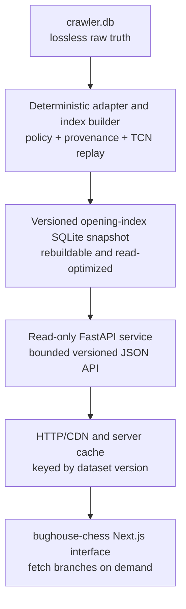

# Opening-explorer platform architecture

This document defines the intended boundary between the irreplaceable crawler
corpus, the rebuildable opening tree, the public read service, and the
`bughouse-chess` interface. It is the architectural target for the next product
phase; measurements from representative index builds may refine implementation
details without collapsing these ownership boundaries.

## Architecture at a glance



In compact form:

```text
crawler.db (lossless raw truth)
        ↓
versioned derived opening-index SQLite snapshot
        ↓
read-only FastAPI/read service
        ↓
bughouse-chess Next.js interface
```

The browser never receives either SQLite database. It receives small,
cacheable responses for the position and branch the user is currently
exploring.

## Design principles

### Lossless raw truth

`crawler.db` owns source payloads, canonical board UUIDs, participants,
qualification state, crawl provenance, terminal gaps, and correction evidence.
It remains ordinary queryable SQLite and is mutated only by crawler operations
or explicit audited reconciliations.

The raw store is not shaped around frontend latency. It is the evidence from
which every derived artifact can be rebuilt. Backup compression must restore
to identical SQLite bytes before parsing; future live-storage reduction is a
separate, deferred decision.

### Rebuildable derived data

The opening-index database is a product artifact, not a second source of truth.
Its schema may use compact integer identifiers, aggregates, selective indexes,
or other read-oriented structures because it can always be regenerated from a
specific raw snapshot plus versioned build policy.

Every published index version must record:

- a dataset/index version;
- the raw snapshot or crawler watermark it represents;
- adapter and index-policy versions;
- included/excluded source classes and anomaly policies;
- maximum indexed ply or other traversal limits;
- source board UUID and content hash for correction/invalidation;
- build timestamp, counts, integrity results, and benchmark evidence; and
- move-data coverage, including the effect of empty TCN records.

### Read-only publication

The public API opens an immutable or read-only derived snapshot. It has no
crawler credentials and cannot enqueue work or write to `crawler.db`. A new
index is built and validated under a new version, then published atomically;
clients must never observe a partially rebuilt tree.

### Bounded client work

The client asks for only the current position, its immediate continuations,
and a small number of representative games. It does not download the tree, a
username corpus, raw payloads, or unbounded fact rows.

## Layer 1 — crawler database

Responsibilities:

- retain every canonical Bughouse board and authoritative participant row;
- preserve source JSON, TCN, hashes, identifiers, jobs, events, and gaps;
- maintain qualification and permanent-tracking policy;
- ingest monthly corrections idempotently; and
- expose stable read interfaces for the derived-data adapter.

The adapter should read a consistent snapshot or bounded watermark rather than
race the mutable live database. Initial index experiments should use a checked
clone. A production monthly pipeline can later coordinate snapshot creation,
incremental indexing, validation, and atomic publication.

## Layer 2 — versioned opening-index snapshot

The retained indexer is the reference starting point. It replays TCN into
positions and move edges and stores game membership needed for filtering and
examples. The port should introduce an explicit crawler adapter rather than
making the indexer understand crawler-control tables directly.

### Adapter contract

For each accepted board, the adapter should provide:

- board UUID and content hash;
- end timestamp, ratings, players, results, and time control;
- standard initial position and TCN move sequence;
- source class (`public` or `callback`); and
- policy/provenance flags relevant to downstream disclosure.

Malformed or policy-excluded records should produce counted, explainable
outcomes rather than disappearing silently.

### Initial policy decisions

Before the representative build, define treatment of:

- empty TCN boards;
- callback-only boards;
- terminal archive/month gaps;
- rating zero and implausible rating outliers;
- same-account white/black boards;
- one-way versus reciprocal partner references;
- corrected source payloads; and
- games beyond any publication freshness watermark.

Raw retention and index inclusion are different decisions. Excluding a board
from the opening tree must never delete or rewrite its crawler record.

### Representative build gate

Build a representative subset before choosing the production depth or schema.
Measure:

- accepted/skipped games and reasons;
- games and plies processed per second;
- positions, move edges, facts, and aggregates;
- facts per game and growth by indexed ply;
- peak RAM, temporary bytes, WAL growth, and final B-tree sizes;
- cold and warm root/deep-position query latency; and
- correction and incremental-update behavior.

`game_facts` is expected to be the main size risk because filters and example
lookups require per-game membership. That expectation must be measured rather
than used as a hosting forecast.

## Layer 3 — read-only API

FastAPI remains a suitable reference service because the existing server
already models position, move, game, metadata, and username queries. The
production contract should be versioned independently from internal table
names.

### Candidate endpoints

- `GET /api/meta` — dataset version, root position, indexed depth, coverage,
  policy version, and freshness watermark.
- `GET /api/positions/{position_id}/moves` — bounded continuations with child
  ids, move notation, aggregate results, and optional lightweight filter data.
- `GET /api/positions/{position_id}/games` — a strictly limited set of
  representative games.
- `GET /api/positions/lookup?fen=...` — canonical FEN lookup where needed.
- `GET /api/players?prefix=...` — server-side prefix search over indexed
  identities rather than a complete username download.

Exact response fields and limits should be fixed after the representative
benchmark. Every response should carry or be keyed by the dataset version.

### Query and cache behavior

- serve default move counts from precomputed aggregates;
- keep arbitrary filters bounded and indexed;
- use strong ETags or immutable versioned URLs;
- cache by dataset version, position id, and normalized filter tuple;
- cap example games and encoded response bytes;
- measure P50/P95/P99 latency, rows scanned, CPU, cache hit rate, and response
  bytes; and
- reject unbounded branch depth, node count, or fact export.

HTTP response compression is independent of database compression. JSON may be
compressed in transit by the server/CDN without changing how either SQLite
database is stored or parsed.

## Layer 4 — `bughouse-chess` Next.js client

The product interface belongs in the existing `bughouse-chess` application so
it can reuse board, replay, identity, and game models. The frozen Vite frontend
is behavioral reference material, not a second production application.

### Bandwidth and interaction rules

1. Fetch the current position's moves and representative games concurrently,
   while allowing moves to render first.
2. Prefetch only the top few likely child positions, initially one level deep;
   measure before changing that limit.
3. Never recursively prefetch the tree. Branching makes request and byte growth
   exponential.
4. Use `AbortController` or a navigation generation id so stale responses
   cannot overwrite a newer position.
5. Cache by dataset version and filter tuple so publication invalidates old
   data without manual cache surgery.
6. Lazy-load player search and use prefix results rather than shipping hundreds
   of thousands of usernames.
7. Set explicit response and example-game limits, then record actual compressed
   bytes during browser benchmarks.
8. Keep raw source JSON and crawl administration entirely outside browser
   reach.

A bounded branch endpoint may eventually return the current position plus a
small number of top-child summaries. It must have hard node, depth, and byte
limits and should be compared with ordinary HTTP/2 parallel requests before it
is adopted.

## Publication lifecycle

```text
checked raw snapshot
    -> deterministic index build under a new version
    -> structural, provenance, replay, and latency validation
    -> publish immutable derived snapshot
    -> atomically switch API dataset version
    -> warm or naturally fill caches
    -> retain previous version for rollback
```

If a monthly crawl changes source content, the next index build uses UUID plus
content hash to identify additions or corrections. Publication is a deployment
operation; it does not write back into the crawler database.

## Failure isolation and recovery

- Loss of the derived index: rebuild it from the checked raw snapshot and
  versioned policy.
- Bad index build: do not publish it; keep serving the previous version.
- Bad publication: atomically roll back the API's dataset pointer.
- API outage: crawler and raw corpus remain unaffected.
- Client regression: the API and both databases remain independently
  testable.
- Raw database loss: restore through `BACKUP_RECOVERY.md`; derived snapshots do
  not replace raw recovery.

## Immediate sequence

1. Inspect and run the retained reference frontend, indexer, and read server
   locally so the existing product behavior is understood before porting it.
2. Define the first opening-index inclusion/provenance and terminal-node policy.
3. Implement the crawler-to-index adapter against a checked snapshot.
4. Build and benchmark a representative derived snapshot, including adaptive
   termination once a position belongs to only one game.
5. Freeze the first versioned API contract from measured query shapes, including
   efficient player-plus-colour filtering.
6. Verify a read-only FastAPI instance against that snapshot.
7. Integrate branch-on-demand exploration into `bughouse-chess` and measure
   browser latency and transferred bytes.
8. Add a repeatable monthly snapshot/build/validate/publish workflow.

Live raw-database compression is deliberately absent from this sequence. It
may be reconsidered later if storage pressure justifies the added operational
and parsing complexity, but it is not a prerequisite for the opening explorer.
