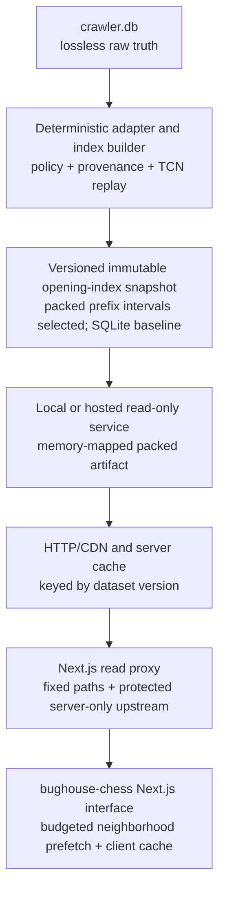

# Opening-explorer platform architecture

This document defines the intended boundary between the irreplaceable crawler
corpus, the rebuildable opening tree, the public read service, and the
`bughouse-chess` interface. It is the architectural target for the next product
phase; measurements from representative index builds may refine implementation
details without collapsing these ownership boundaries.

## Architecture at a glance



In compact form:

```text
crawler.db (lossless raw truth)
        ↓
versioned immutable derived opening-index snapshot
        ↓
read-only bounded read service
        ↓
bughouse-chess Next.js interface
```

The browser never receives either SQLite database or the complete packed
artifact. It receives bounded, cacheable node neighborhoods and game details
for the move-prefix region the user is currently exploring. The first product
experiment runs the same boundary locally: a localhost service memory-maps a
representative packed artifact and a same-origin Next.js read proxy forwards
the bounded client operations. This keeps the loopback origin server-only and
avoids browser/extension cross-origin policy differences. The proxy does not
transform responses. A later hosted service can replace this local transport
adapter without replacing the versioned service contract or client navigation
model.

## Design principles

### Lossless raw truth

`crawler.db` owns source payloads, canonical board UUIDs, participants,
qualification state, crawl provenance, terminal gaps, and correction evidence.
It remains ordinary queryable SQLite and is mutated only by crawler operations
or explicit audited reconciliations.

The raw store is not shaped around frontend latency. It is the evidence from
which every derived artifact can be rebuilt. Backup compression must restore
to identical SQLite bytes before parsing; future live-storage reduction is a
separate, deferred decision.

### Rebuildable derived data

The opening-index database is a product artifact, not a second source of truth.
Its schema may use compact integer identifiers, aggregates, selective indexes,
or other read-oriented structures because it can always be regenerated from a
specific raw snapshot plus versioned build policy.

Every published index version must record:

- a dataset/index version;
- the raw snapshot or crawler watermark it represents;
- adapter and index-policy versions;
- included/excluded source classes and anomaly policies;
- maximum indexed ply or other traversal limits;
- source board UUID and content hash for correction/invalidation;
- build timestamp, counts, integrity results, and benchmark evidence; and
- move-data coverage, including the effect of empty TCN records.

### Read-only publication

The public API opens an immutable or read-only derived snapshot. It has no
crawler credentials and cannot enqueue work or write to `crawler.db`. A new
index is built and validated under a new version, then published atomically;
clients must never observe a partially rebuilt tree.

### Bounded client work

The client asks for the current position, all immediate continuations, and a
bounded forward neighborhood. It caches immutable nodes by dataset version so
visited backward navigation requires no new request. Deeper prefetch targets a
small number of moves but is constrained by hard node and encoded-byte budgets,
not depth alone. It does not download the tree, a username corpus, raw payloads,
or unbounded fact rows.

## Layer 1 — crawler database

Responsibilities:

- retain every canonical Bughouse board and authoritative participant row;
- preserve source JSON, TCN, hashes, identifiers, jobs, events, and gaps;
- maintain qualification and permanent-tracking policy;
- ingest monthly corrections idempotently; and
- expose stable read interfaces for the derived-data adapter.

The adapter should read a consistent snapshot or bounded watermark rather than
race the mutable live database. Initial index experiments should use a checked
clone. A production monthly pipeline can later coordinate snapshot creation,
incremental indexing, validation, and atomic publication.

## Layer 2 — versioned derived opening index

The retained indexer is a behavioral and benchmark reference, not a schema,
framework, or file-format constraint. It replays TCN into positions and move
edges and demonstrates game membership needed for filtering and examples. The
production slice may use a redesigned SQLite schema, immutable packed arrays,
compressed bitmap postings, an embedded key/value store, another build
language, or a measured hybrid. Every candidate must consume the same explicit
crawler-adapter contract rather than crawler-control tables directly.

### Adapter contract

For each accepted board, the adapter should provide:

- board UUID and content hash;
- end timestamp, ratings, players, results, and time control;
- standard initial position and TCN move sequence;
- source class (`public` or `callback`); and
- policy/provenance flags relevant to downstream disclosure.

Malformed or policy-excluded records should produce counted, explainable
outcomes rather than disappearing silently.

### Initial policy decisions

Before the representative build, define treatment of:

- empty TCN boards;
- callback-only boards;
- terminal archive/month gaps;
- rating zero and implausible rating outliers;
- same-account white/black boards;
- one-way versus reciprocal partner references;
- corrected source payloads; and
- games beyond any publication freshness watermark.

Raw retention and index inclusion are different decisions. Excluding a board
from the opening tree must never delete or rewrite its crawler record.

### Representative build gate

Build comparable representative subsets before choosing the production storage
engine, depth, or schema. Node identity is already fixed as the exact move
prefix. Include a compact relational
baseline and at least one materially different representation; compressed
game-id bitmap postings deserve explicit measurement because
player-plus-colour filtering is set intersection plus cardinality. The leading
alternative is a prefix-interval packed trie: after sorting games by exact move
sequence, every prefix maps to a contiguous game-ordinal range, and each
player/seat can be indexed by a sorted ordinal posting list.
Measure:

- accepted/skipped games and reasons;
- games and plies processed per second;
- trie nodes, move edges, membership/posting entries, and aggregates;
- membership per game and growth by indexed ply;
- peak RAM, temporary bytes, write amplification, and final component sizes
  (including B-tree sizes for SQLite candidates);
- cold and warm root/deep-node query latency; and
- correction and incremental-update behavior.

`game_facts` is expected to be the main size risk in the relational baseline
because filters and example lookups require membership. The prefix-interval
candidate may avoid that row-per-node-per-game shape. Both expectations must be
measured rather than used as hosting forecasts.

The representative slice is now complete; see
[`OPENING_TREE_ARCHITECTURE_PROTOTYPE_2026-08-03.md`](OPENING_TREE_ARCHITECTURE_PROTOTYPE_2026-08-03.md).
It selected the prefix-interval packed trie with sorted ordinal postings and
retained SQLite as the oracle/baseline. The full corpus contains 11,626,980
logical nodes before the short-line policy refinement. The revised production
policy excludes non-checkmate games of six plies or fewer, retains 431 genuine
short checkmates, and contains 6,516,478 games, 11,625,223 logical nodes, and
96,570,295 relational membership entries. The revised projection is about 3.23
GiB packed versus 5.38 GiB SQLite. Dense zlib bitmap postings were rejected. A
streaming artifact writer remains mandatory before any full build because the
representative in-memory builders do not meet the production RAM target when
extrapolated.

### Node identity

The first product is a move-prefix trie. A node is the exact decoded move
sequence from the start; transpositions remain separate paths. Board placement,
side, castling, and en-passant state are replayed for display but do not identify
or merge nodes. Pocket holdings remain meaningful context but do not split a
shared prefix: games with the same move sequence share a node even if their
pockets differ. Drop moves remain first-class navigable edges and update the
displayed board. Holdings may later be exposed as bounded annotations without
changing trie identity. Holdings-aware state graphs are deferred.

### Adaptive terminal policy

The 2 August 2026 exploratory evidence in
`OPENING_TREE_EXPLORATION_2026-08-02.md` supports replacing a fixed-depth-only
tree with exact support-aware termination. Count distinct accepted games per
exact move prefix. Collapse a path at its first globally support-one prefix and
store an explicit reference to that game; otherwise terminate at game end.
Identical complete lines may retain multiple game references, and an ended game
may coexist with outgoing continuations at the same node.

Global support one is a safe physical stopping point for every subset. A
player-plus-colour filter can reach support one earlier, so the read API must be
able to return a filtered terminal and its sole game while the global trie
continues deeper. Sorted fixed-width TCN token strings, streaming prefix counts,
and compressed radix/Patricia construction are all candidates for the exact
build. Any replay safety limit or decode failure is a separately counted build
outcome, never an ordinary terminal.

## Layer 3 — read-only API

FastAPI remains a possible reference service because the existing server
already models position, move, game, metadata, and username queries. Neither
FastAPI nor another framework is selected by the storage slice. The production
contract should be versioned independently from internal records and fixed
only after the streaming writer and read-service benchmark.

### Local memory-mapped experiment

The next product slice is a local vertical prototype, not an internet
deployment. A thin read-only service opens a representative packed artifact
with memory mapping and exposes the same bounded query boundary that a later
hosted service would use. Mapping the files makes the complete artifact
addressable without parsing it into Python objects or loading it into browser
JavaScript memory; the operating system pages touched regions into RAM.

The revised 3.23 GiB projection is dominated by approximately 2.62 GiB of
prototype JSON-lines game metadata. Nodes and edges together are about 466 MiB,
while postings, offsets, and directories add roughly 153 MiB. Navigation should
therefore read node/edge/posting records eagerly as needed and load bounded game
metadata only when a terminal or example-game panel requests it. The streaming
writer should replace the verbose metadata representation before freezing the
full format.

The local service and client are experimental contracts. They must remain
versioned and independently testable, but they may change in response to the
prefetch and UX benchmarks. The framework is still not architectural.

### Candidate endpoints

- `GET /api/meta` — dataset version, root node, indexed depth, coverage,
  policy version, and freshness watermark.
- `GET /api/nodes/{node_id}/moves` — bounded continuations with child
  ids, move notation, aggregate results, and optional lightweight filter data.
- `GET /api/nodes/{node_id}/neighborhood` — the anchor, every immediate child,
  and a deeper forward subset selected under explicit depth, node, and encoded-
  byte budgets; return flat node/edge records plus frontier ids rather than an
  unbounded recursive object.
- `GET /api/nodes/{node_id}/games` — a strictly limited set of
  representative games.
- optional FEN lookup must acknowledge that several move prefixes can display
  the same placement; FEN is not node identity.
- `GET /api/players?prefix=...` — server-side prefix search over indexed
  identities rather than a complete username download.

Exact response fields and limits should be fixed after the representative
benchmark. Every response should carry or be keyed by the dataset version.

### Budgeted neighborhood semantics

Depth is a target, not permission to return the complete radius. In the revised
full shape, the root through ply five contains approximately 97,057 nodes. A
literal depth-five subtree would therefore be an unsuitable default response,
especially after JSON encoding and filter aggregates.

A neighborhood query should:

1. always include the anchor and all of its immediate children;
2. expand deeper continuations by descending-support parent, admitting that
   parent's complete immediate move list as an atomic group only when the group
   fits the hard node/byte budgets;
3. return a flat collection keyed by node id so overlapping responses merge
   into the client cache without duplication;
4. identify every truncated boundary as a frontier with `has_more` or equivalent
   state;
5. include parent/path information sufficient for a deep link to reconstruct
   breadcrumbs without fetching siblings;
6. bind filtered aggregates to the normalized filter tuple while allowing
   immutable structural node/edge data to be cached independently if that split
   measures better; and
7. reject an unknown dataset version or node id rather than mixing versions.

The prototype should start with a target depth of five but conservative default
budgets, then compare per-move fetches, fixed depths, and the adaptive budgeted
strategy on deterministic navigation traces. A server-side traversal can follow
the packed child ranges directly; serialization size and branching, rather than
individual memory-mapped record lookup, are expected to set the useful limit and
must be measured.

### Query and cache behavior

- serve default move counts from precomputed aggregates;
- keep arbitrary filters bounded and indexed;
- use strong ETags or immutable versioned URLs;
- cache by dataset version, node id, and normalized filter tuple;
- cap example games and encoded response bytes;
- deduplicate overlapping neighborhood requests and expose truncation/frontier
  counts for client instrumentation;
- measure P50/P95/P99 latency, rows scanned, CPU, cache hit rate, and response
  bytes; and
- reject unbounded branch depth, node count, or fact export.

HTTP response compression is independent of database compression. JSON may be
compressed in transit by the server/CDN without changing how either SQLite
database is stored or parsed.

## Layer 4 — `bughouse-chess` Next.js client

The product interface belongs in the existing `bughouse-chess` application so
it can reuse board, replay, identity, and game models. The frozen Vite frontend
is behavioral reference material, not a second production application.

### Bandwidth and interaction rules

1. Fetch a bounded node neighborhood and representative games independently,
   while allowing the board and immediate moves to render first.
2. Cache flat structural records by `(dataset_version, node_id)` and filtered
   overlays by the normalized filter tuple. Retain the visited path and its
   cached immediate move lists in a bounded LRU so ordinary backward navigation
   is complete, local, and instant.
3. Treat depth five as a prefetch target, never an unconditional radius. Always
   fetch immediate moves, then expand high-support descendants only while the
   node and byte budgets permit.
4. Mark truncated nodes as frontiers. Refill when the selected continuation is
   absent from cache or when idle prefetch reaches a configured frontier
   threshold; do not wait until the user is already blocked if the next likely
   request can be issued safely in the background.
5. Deduplicate overlapping in-flight neighborhoods and merge responses by node
   id. Do not recursively produce unbounded requests or responses.
6. Use `AbortController` or a navigation generation id so stale responses
   cannot overwrite a newer position.
7. Cache by dataset version and filter tuple so publication invalidates old
   data without manual cache surgery.
8. Lazy-load player search and use prefix results rather than shipping hundreds
   of thousands of usernames.
9. Set explicit node, depth, response-byte, and example-game limits, then record
   request count, cache-hit navigation, and actual compressed bytes during
   browser benchmarks.
10. Keep raw source JSON and crawl administration entirely outside browser
    reach.

For the local experiment, the browser calls a same-origin Next.js proxy. It
accepts only metadata, neighborhood, bounded-game, and player-prefix GET shapes
and refuses non-loopback upstream origins. The route is always available, but a
missing local reader produces a bounded 503. This is a transport adapter, not a
frozen production API layer.

A bounded neighborhood endpoint is the leading experiment, not yet a frozen
production contract. Compare it with one-request-per-move and narrow parallel
requests. The client should instrument how many moves are served entirely from
cache, how often frontiers block interaction, and how much unused prefetched
data is evicted.

## Publication lifecycle

```text
checked raw snapshot
    -> deterministic index build under a new version
    -> structural, provenance, replay, and latency validation
    -> publish immutable derived snapshot
    -> atomically switch API dataset version
    -> warm or naturally fill caches
    -> retain previous version for rollback
```

If a monthly crawl changes source content, the next index build uses UUID plus
content hash to identify additions or corrections. Publication is a deployment
operation; it does not write back into the crawler database.

## Failure isolation and recovery

- Loss of the derived index: rebuild it from the checked raw snapshot and
  versioned policy.
- Bad index build: do not publish it; keep serving the previous version.
- Bad publication: atomically roll back the API's dataset pointer.
- API outage: crawler and raw corpus remain unaffected.
- Client regression: the API and both databases remain independently
  testable.
- Raw database loss: restore through `BACKUP_RECOVERY.md`; derived snapshots do
  not replace raw recovery.

## Immediate sequence

1. Implement the revised adapter policy with a counted
   `short_non_checkmate` outcome while retaining short checkmates; preserve the
   completed exact-prefix semantics, packed-format selection, SQLite oracle,
   and benchmark corpus documented on 3 August 2026.
2. Replace the representative in-memory build path with an external-sort,
   streaming packed writer, improve the verbose metadata component, and repeat
   the 100k then larger representative benchmarks under the 4 GiB RAM and 5 GiB
   projected-artifact gates.
3. Build a thin local memory-mapped read service over the representative packed
   artifact. Prototype the bounded neighborhood query with target depth five,
   hard node/byte budgets, deterministic expansion, and explicit frontiers.
4. Add a local-only explorer route in `bughouse-chess`. Cache versioned flat
   nodes, make backward navigation local, refill approaching frontiers, cancel
   stale requests, and keep game metadata lazy.
5. Compare one-request-per-move, fixed-depth, and adaptive budgeted prefetch on
   root, popular-line, deep, backtracking, and filtered navigation traces.
   Measure service latency, response bytes, request count, cache hit rate,
   blocked clicks, unused prefetch, and client render latency before freezing
   the contract.
6. Measure reliable physical writes and temporary space, deterministic rebuild,
   correction, validation, atomic publication, and rollback for the streaming
   writer. Build the full corpus only after all representative gates pass; keep
   the checked raw snapshot immutable and retain the previous derived version.
7. Swap the full local artifact into the same service and use it for UX
   iteration. Freeze the first hosted API contract only after the local query
   and prefetch evidence is complete.
8. In a later hosting slice, deploy the read boundary, add versioned HTTP/CDN
   caching, and preserve atomic publication/rollback without changing the
   frontend navigation model.
9. Add a repeatable monthly snapshot/build/validate/publish workflow.

Live raw-database compression is deliberately absent from this sequence. It
may be reconsidered later if storage pressure justifies the added operational
and parsing complexity, but it is not a prerequisite for the opening explorer.

## Implemented local vertical evidence — 3 August 2026

The first local implementation now preserves the boundaries in this document:

- `opening-adapter-v2-short-non-checkmate` is the counted adapter policy;
- the selected writer uses an explicit external-sort SQLite stage and streams
  packed records without retaining the corpus or logical trie as Python
  objects;
- `packed-prefix-interval-v2` replaces verbose game JSON lines with
  independently compressed random-access records while keeping the selected
  36-byte node and 6-byte edge layouts unchanged;
- the read service validates then memory-maps an immutable version and binds
  only loopback;
- structural node/edge records and normalized-filter overlays are separate in
  the response and client cache; and
- the Next.js surface is an additive, local-only `/opening-explorer` page with
  feature-owned state and replay code.

Repeated samples project about 2.58 GB at full policy scale with 61–72 MB
observed peak RSS. After atomic deeper-parent expansion, the 500-node/256 KiB
adaptive default measured 2.99–7.16 ms P50 and below 8 ms P99 across
unfiltered, independent-seat, and exact-pair root queries. A browser-policy
simulation requiring complete move lists used two foreground requests and zero
idle refills on a popular six-move trace. These are
representative local measurements, not a hosted-service contract.

The complete evidence and commands are in
`OPENING_EXPLORER_VERTICAL_PROTOTYPE_2026-08-03.md`. A full build remains
blocked on reliable physical-write measurement. A later live retry validated
the same-origin HTTP boundary and cached `e4` navigation in Chrome; the
filter/cancellation/back-forward browser matrix remains outstanding.

The next hosted experiment is deliberately representative-only. Because the
web application already runs on Vercel, evaluate Vercel Functions with a
packaged artifact, Vercel Blob with verified function-local materialization,
Marketplace Neon/Turso projections, Preview Deployments, and narrowly scoped
Edge Config/Upstash support before external compute. Retain an external
container as a comparison control and preserve the packed artifact as the
correctness oracle. Any persistent browser tier—HTTP cache, Cache Storage, or
IndexedDB—sits beneath the 5,000-node memory LRU and is selected by measured
network and revisit benefit. See
`HOSTED_OPENING_EXPLORER_PLAN_2026-08-03.md`.

## Hosted read-boundary refinement — 3 August 2026 (pre-deployment record)

This section preserves the design before the live probe. The implemented result
is recorded in the later hosted-boundary section.

The pre-deployment design keeps the packed artifact as the oracle and selects a
bundled Python Vercel Function provisionally for the representative experiment.
This choice is contingent on a standalone live compatibility gate; local mmap
success is not treated as proof of Vercel bundle extraction, cold start, warm
reuse, concurrency, or regional latency. The external-container control retains
the same reader so provider effects can be separated from representation effects.

The HTTP boundary validates the immutable artifact before readiness and exposes
separate liveness/readiness operations. Versioned reads retain the settled hard
budgets and add bearer authentication, bounded concurrency with a short queue,
deterministic strong validators, immutable private cache directives, and timing
headers that do not destabilize response bodies. The Next.js proxy remains the
preferred browser boundary: it strictly allowlists paths and HTTPS origins,
owns the server-only credential, applies a strict timeout, forwards validators,
and does not expose the artifact or any corpus to browser storage.

The representative trial originally used a distinct Preview capability. After
the trial passed and normal exposure was explicitly approved, the route,
sidebar, and proxy availability gates were retired. The explorer now renders in
local development, Preview, and Production; a missing or unreachable local
reader produces a bounded 503 rather than hiding the feature. The service
origin and bearer credential remain server-only, the origin and paths remain
strictly allowlisted, and proxy timeouts and response budgets remain enforced.

HTTP caching is the baseline persistent tier. Cache Storage and IndexedDB may
store only complete bounded responses keyed by immutable dataset and normalized
query identity, remain subordinate to the 5,000-node memory LRU, and require
measured hosted benefit before selection. The packed artifact, raw data, and an
unbounded username corpus never enter browser storage.

See `HOSTING_PROVIDER_COMPARISON_2026-08-03.md` for current provider constraints,
costs, correction/rollback/removal procedures, and the external approval gate.

## Implemented hosted representative boundary — 3 August 2026

The representative deployment keeps the same architectural seam:

```text
validated packed artifact in read-only Function bundle
  -> one checksum-validated memory-mapped Python reader per warm instance
  -> authenticated bounded HTTPS read API
  -> exact-allowlisted server-side Next.js proxy
  -> immutable versioned HTTP response
  -> 5,000-node browser memory LRU
```

The compatibility probe proved that the first two steps work in Vercel's Python
runtime for the 36,782,672-byte artifact. Readiness is false until every
manifest checksum has passed. Liveness is public; readiness and reads require a
server-only bearer token. No service route exposes the deployment artifact.
Requests pass through a short bounded concurrency queue and retain the 500-node/
256 KiB defaults and 4,000-node/512 KiB hard caps.

The Next.js boundary remains preferable to direct browser-to-service access. It
keeps the origin and token server-only, allowlists only metadata, player-prefix,
neighborhood, and bounded-game paths, applies a strict timeout, forwards
validators and timing, and maps configuration/network failures to a bounded 503.
Page, sidebar, and proxy are present in every build after the successful
representative Production trial. Availability no longer depends on hostname or
environment flags. The service origin and credential remain server-only;
hosted origins require an exact allowlist entry and HTTPS, while development
permits only a loopback HTTP reader.

HTTP caching is now the settled persistent browser tier for the representative
version. Cache keys include the immutable dataset version and normalized query.
Cache Storage and IndexedDB remain valid future alternatives, but are not part
of the current architecture because native HTTP caching measured a 0.3 ms,
zero-transfer warm revisit. Filtered overlays remain in memory only.

Correction preserves immutability: stage and validate a new artifact/version,
deploy it separately, pass readiness and the semantic corpus, then change the
web boundary. Rollback restores the previous deployment/version. Removal first
redirects or removes the service version through an explicit code and
configuration change, validates bounded unavailable behavior, then removes
deployments and scoped credentials. The UI route may remain available with its
unavailable state unless a separate approved product change removes it.

This architecture is selected only for the representative artifact. The
projected 2.58 GB file exceeds the standard Function bundle limit; no full
artifact path is frozen.

## Full-tree startup and scale boundary — next slice

The browser startup path remains deliberately bounded:

```text
route/hydration
  -> GET metadata
  -> GET one root or deep-link neighborhood (500 nodes / 256 KiB default)
  -> merge into 5,000-node memory LRU
  -> replay the returned exact prefix and render
```

This path does not transfer the artifact to the browser. Scaling risk is split
between cold readiness and request execution. The next slice must time process
import, manifest parsing, every component checksum, file opens, mmap creation,
first metadata, first bounded neighborhood, warm requests, client merge/replay,
and first useful paint separately. Classify each phase as constant,
file-count-dependent, artifact-byte-linear, postings-dependent, or request-
budget-bounded.

The leading hypothesis is that manifest checksum validation reads artifact
bytes linearly, whereas mmap creation alone need not make all pages resident
and an unfiltered neighborhood traversal remains bounded by node/byte limits.
This must be verified with representative cold-process repetitions and the
actual full artifact. Record CPU, wall time, mapped and resident bytes, page
faults, disk reads, response sizes, and P50/P95/P99.

The full artifact must be produced by the existing deterministic streaming
writer from an explicit separate restored snapshot with a recorded checksum.
Never build directly from `data/crawler.db`. Publish to a new immutable version,
preserve the representative as oracle and rollback, validate every component,
and compare identical navigation/filter/terminal/concurrency traces without
relaxing response budgets.

No production architecture is selected by the projected 2.58 GB size. Refresh
current Vercel Large Functions limits and measure the built artifact; compare a
bundled immutable artifact, object-storage materialization, and the existing
reader in a small external container. A database projection must prove exact-
prefix correctness and material operational benefit against the packed oracle.
Any upload or live version switch requires separate approval after local
evidence, cost, correction, rollback, removal, and AGPL procedures are reviewed.
